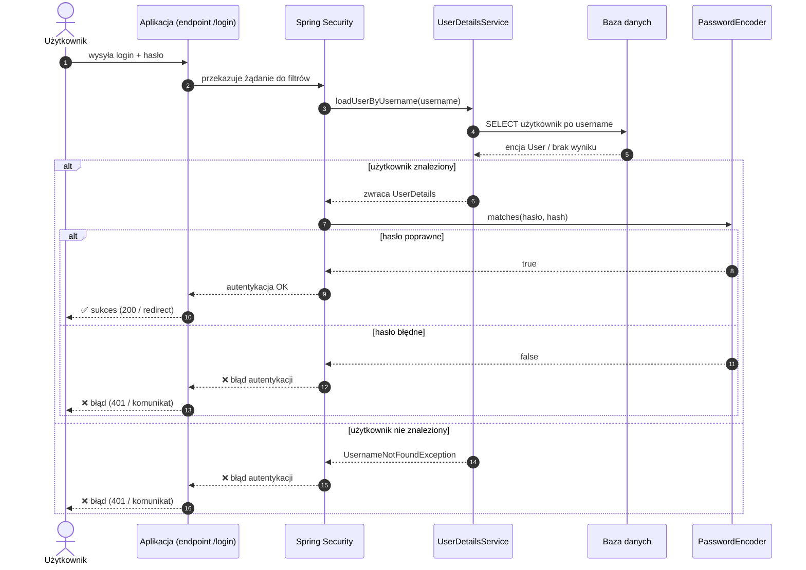

# 🧭 UserDetailsService – skąd Spring Security bierze użytkownika

> Jak Spring Security **ładuje użytkownika** podczas logowania i podejmuje decyzję o dostępie

---

## ⏱️ 5. UserDetailsService – skąd Spring Security bierze użytkownika

Skoro mamy już:

* encję użytkownika w bazie,
* adapter w postaci `UserDetails`,

…to brakuje nam jeszcze jednego elementu układanki:

**kto i jak dostarcza Spring Security obiekt `UserDetails` na podstawie username?**

Odpowiedź: **`UserDetailsService`**.

---

## 🧩 5.1. Rola UserDetailsService

`UserDetailsService` to interfejs Spring Security, który definiuje **jeden kluczowy kontrakt**:

### ✅ Jeden kluczowy kontrakt

* `loadUserByUsername(String username)`

Ta metoda ma zwrócić:

* obiekt `UserDetails` (np. nasz adapter),

albo zgłosić błąd, jeśli użytkownik nie istnieje.

---

### ⏰ Kiedy i przez kogo jest wywoływany?

Podczas logowania:

1. użytkownik wysyła login + hasło,
2. Spring Security uruchamia proces autentykacji,
3. w trakcie tego procesu **wywołuje `UserDetailsService`**, aby pobrać dane użytkownika.

Najczęściej wywołuje to komponent odpowiedzialny za autentykację, np.:

* `DaoAuthenticationProvider`

> 💡 Nie musisz go tworzyć ręcznie — Spring Security dobiera odpowiedni provider na podstawie konfiguracji.

---

## 🗄️ 5.2. Integracja z bazą danych

Najpopularniejsza implementacja `UserDetailsService` pobiera użytkownika z bazy danych przez repozytorium JPA.

### 🧱 Repozytorium JPA

Typowe podejście:

* `UserRepository` z metodą np. `findByUsername(...)` lub `findByEmail(...)`.

`UserDetailsService`:

* woła repozytorium,
* mapuje encję → `UserDetails`,
* zwraca wynik do Spring Security.

---

### 🚫 Obsługa przypadku „user not found”

Jeśli użytkownika nie ma w bazie:

* **nie zwracamy `null`**,
* zgłaszamy wyjątek.

### 🎯 Rzucanie `UsernameNotFoundException`

To standardowy sygnał dla Spring Security:

* *„taki użytkownik nie istnieje”*

Spring Security potraktuje to jako:

* błąd logowania (np. 401 / niepoprawne dane).

> 💡 Dla bezpieczeństwa zwykle nie rozróżnia się komunikatów „zły login” vs „złe hasło”.

---

## 🔄 5.3. Przepływ logowania

Poniżej prosty, typowy flow dla logowania (np. form login / basic auth):

1. użytkownik wysyła **login + hasło**,
2. Spring Security wywołuje **`UserDetailsService`**,
3. `UserDetailsService` pobiera użytkownika z bazy i zwraca `UserDetails`,
4. Spring Security porównuje hasło z hashem (przez `PasswordEncoder`),
5. decyzja: ✅ sukces / ❌ błąd.

---

### 🧩 Diagram (Mermaid)

---
